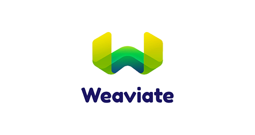
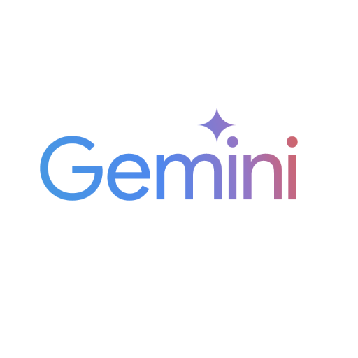
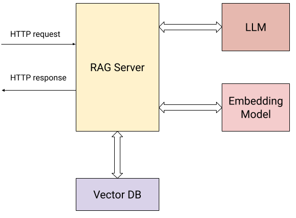

# RAG Server Project
A Retrieval Augmented Generation System (presentation for the Gooogle Developer Groups Devfest 2025)

---
# Technologies

<br/>
<br/>
<br/>
<br/>
<br/>
<br/>
<br/>






---

## System Architecture



- **Backend**: Go HTTP Server
- **Database**: Weaviate Vector DB
- **LLM**: Google Gemini 1.5
- **Frontend**: HTML + AlpineJS

---

# Key Components

- 📝 Document Processing
- 🔤 Text Embedding
- 🔍 Vector Search
- 🤖 LLM Integration
- 🌐 REST API

---

# API Endpoints

### POST /context
```
- Upload documents
- Process embeddings
```

### POST /query
```
- Semantic search
- Context generation
- LLM response
```

---

# Document Processing Flow

```go
func (rs *RagServer) AddDocumentHandler() {
    // Parse documents
    // Generate embeddings
    // Store in Weaviate
}
```

1. Upload via multipart form
2. Process content
3. Generate embeddings
4. Store vectors

---

# Vector Database Integration

```go
wconn, err := weaviate.New(
    weaviate.WithEmbedder(emb),
    weaviate.WithScheme("http"),
    weaviate.WithHost(addr),
)
```

- Semantic search capability
- Efficient similarity matching
- Scalable document storage

---

# Enhancing our implementation

- Streaming responses
- Enhanced context selection
- Document chunking

--- 

# Streaming responses

- Instead of waiting for the complete response, the server sends partial responses as they become available

- Benefits:
  - Faster initial response time
  - Better user experience with progressive content loading
  - Reduced server load since responses are sent incrementally

--- 

# Enhanced context selection

- Improves how relevant context is chosen
  - Semantic similarity scoring between query and documents
  - Ranking documents by relevance
  - Selecting optimal number of context pieces

- Benefits:
  - More accurate responses
  - Better handling of complex queries
  - Reduced irrelevant information in responses

--- 

# Document chunking

- Splits large documents into smaller, manageable pieces

- Benefits:
  - Better handling of large documents
  - Improved context relevance
  - More efficient vector embeddings
  - Reduced token usage

--- 

# How will the enhanced query look

```go
func EnhancedQueryHandler(query string) {
    // 1. Chunk documents if not already chunked
    chunks := utils.ChunkDocument(originalDoc, 500, 100)
    
    // 2. Select relevant context using semantic search
    relevantChunks := rs.selectRelevantContext(query, chunks)
    
    // 3. Stream response using enhanced prompting
    return rs.streamResponse(query, relevantChunks)
}
```
